## Dragan Butkovic
## Student ID: P2408503
## Subject: CTEC3905-2020-21
## Course: Front-End Web Development

### Table of contents
#### 1.0 [Introduction](#introduction)
#### 2.0 [Methodology](#methodology)
#### 3.0 [Planning](#planning)
#### 4.0 [Design](#design)
#### 5.0 [Evaluation](#evaluation)
#### 6.0 [Conclusion](#conclusion)
#### 7.0 [Reference](#reference)
#### 8.0 [Weekly-Journal](#weekly-journal)
#### 9.0 [Reflective Writing](#reflective-writing)

<a name="introduction"></a>
## 1.0 Introduction

The creator of the website “Fitness@Home” is mrxdragan. Author’s main idea for design the site is to help people stay active and fit during the COVID-19 pandemic. When gym closed the pleading for staying at home became everyday routine so author uses responsive mobile and desktop website to recommend exercises to people who care about their wellbeing and health.


<a name="methodology"></a>
## 2.0 Methodology

At the time when people are not able to wonder around and buy things the creativity helps to make up original exercises. Research was conducted to get wider perspective in order to advance should be in staying original in the web site pages and help audience to stay fit and active at home.

The idea for development of the functional practices and advanced HTML, CSS quality, JavaScript, API, JSON framework and responsive design was found with learning materials from Stuart (2021a) and WS3school.

The single web page applications (SPA) encloses four hyperlinks that are accessible from one to one page. This outlines works inside a browser and does not involve page reloading for the duration of use. The website includes following hyperlinks:

* About
* Gain-mass
* Lose-weight
* Contact us

The planning continues with the creation of responsive design at any size. The creation of responsive design started with formation of the design for mobile phones-first, then tablet and Desktop CSS breakpoints.  For example, 1000px in Desktop, less than 500px in tablet and minimum 300px in mobile phone style. The tutorial on github.com helped in comprehending the needed steps for achieving the aimed results and the design idea was organized by Stuart (2021a). Its layout changes based on the size and capabilities of mobile users. This could be seen in content shown a single column views; a tablet might show the same content, while two columns could be seen in Desktop.

Meta viewport tag is in the ```<head>``` section and it is located the html tag and the body.

```<meta charset="utf-8">```

```<meta name="viewport" content="width=device-width, initial-scale=1.0">```

The HTML has added smooth scrolled effect and this scroll-behaviour is smooth in CSS style.

The video sets are only Desktop responsive in its display block, except for mobile phones and tablets where none videos are displayed. The video has object fit covering scale to fill and crop above the navbar.

The animation beating heart with pure CSS is interesting for Fitness@Home website. The beating heart was created by Sina (2019).  The beating heart is used in Fitness@Home website but the red heart colour is changed into the green heart colour and also the size of the heart is changed and fit on navbar. It sets only on Desktop like display is inline-block.

The navbar was developed by Havhannisyan (2020) for creating only a responsive design without bootstrap, and where no CSS frameworks is needed. This is for building the four subheadings and toggling the Menu only in mobile style. This toggle menu can be disabled on tablet and Desktop layout. This idea is very similar to Stuart's idea (2021b).

For creating link effects on the hover event of the visitor four headings of navbar is added using CSS Animation Link Underline elements; Middle outwards (Underwood, 2016). The goal of this is to change the colour and translation time.

Coyier (2019) HTML element idea for the heading placing on the top of the page was used in locating of the heading for the website Fitness@Home.  ```<html lang="en" id="top">``` Its CSS has smooth scroll up to the top, this was learned from Stuart (2021b).

One of the challenge was the idea of the website section “About”, that include the responsive card to change right side with new picture (Vybiral, 2017). This addition improved style in adding more details of the website for the mobile and tablet website design.

The blog post card building is included in the Fitness@Home website. The blog inclusion on websites started by Julio (2019). Including flexbox helps to achieve website layout. While working on this the creator experienced code challenges in bringing together DOM on JavaScript to its slider. This has sophisticated support to current slider.  Once again the green colour was chosen for post card building because the green colour symbolises health and wellbeing. It is as well included for the slide to pulse both the right and left side. It has added an animated rubberBand after clicking currently next and previous.

The form set includes: name, email address, confirmation email and messages. It has codes created by Stuart (2021c). The API that is working is created in JavaScript (Stuart, 2021d) and it connects with the JSON built.

<a name="planning"></a>
## 3.0 Planning

### 3.1 Purpose

In the time of COVID-19 pandemic it is important to stay active and fit. With the lockdowns, the movement restrictions, and gym temporarily closed, physical exercise is essential to keep body and mind in good health. The website "Fitness@Home" is created for people who know exercise is important, who can assemble and set up gym in room at home, with just few pieces of basic training equipment.

### 3.2 Audience

The “Fitness@Home” website is consisting of four search pages: About, Gain-Mass, Lose-Weight, Contact us. This website is suitable for age groups 17 and over. Whoever is concern about staying active and eating health is welcome to join us.

### 3.3 Use Cases

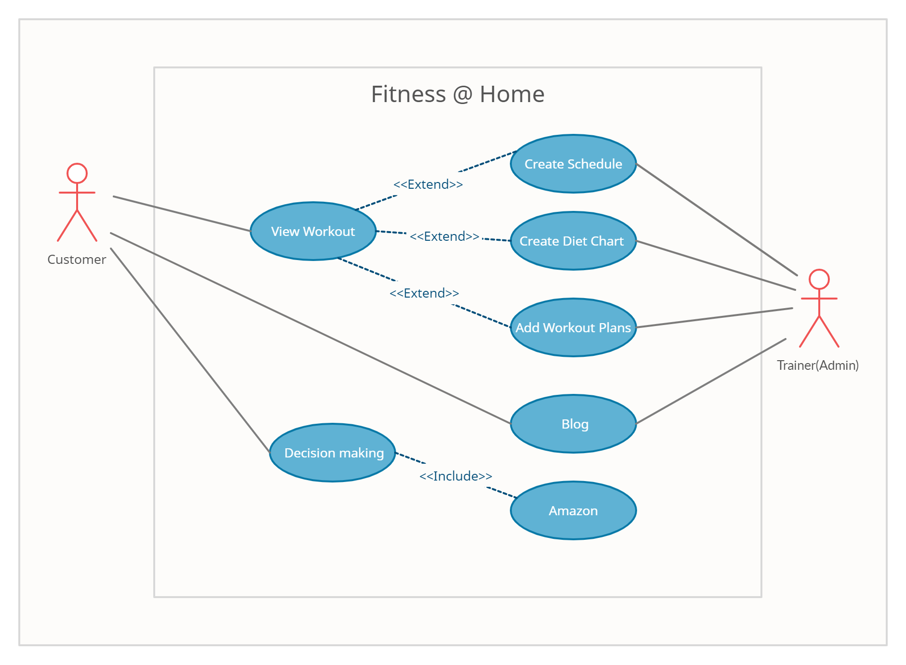

<a name="design"></a>
## 4.0 Design

### 4.1 Website Structure

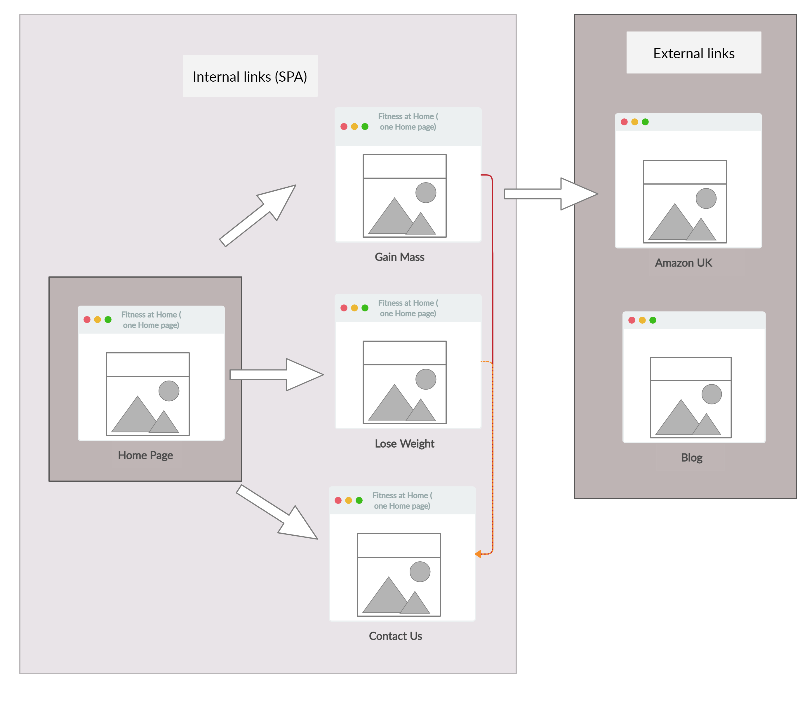

### 4.2 Website Page Layout

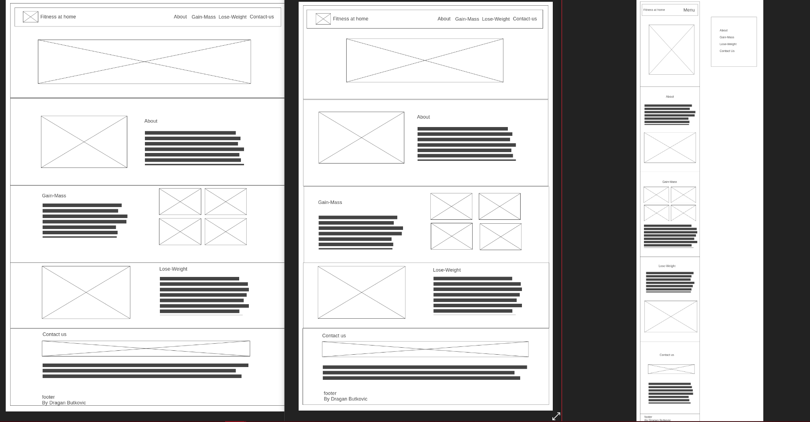

On the left side of Website Page Layout: Desktop,
Middle: Tablet,
Right: Mobile


<a name="evaluation"></a>
## 5.0 Evaluation

### 5.1 Usability

During the creation of Fitness@Home website the attention was paid to appearance, content, functionality, website usability, search engine optimization and DOM external the Application Programming Interface (API).  The website is visually attractive but most importantly the website is very easy to navigate and without difficulty the visitors of the Fitness@Home website can find what they look for.  The website is well planned; its architecture is done thoughtfully with well-organised content. The website Fitness@Home is accessible for mobile users as well. The Fitness@Home website does not take long to load, and included images and videos help users to swiftly skim the website.

### 5.2 Improvements

```<html>```
1. Add "alt" and type name for each image
2. Replace ```<h1>``` heading element to ```<h2>``` or ```<h3>```
3. Remove ```</div>``` from mistake.
4. Change the value of the "for" attribute of the label on form

```<css>```
1. Change from font-weight:bolds to bold
2. Change display from static to flex
3. Remove "X" between translates


Checked HTML
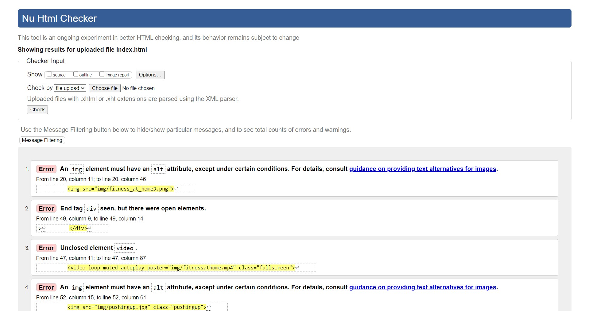
...
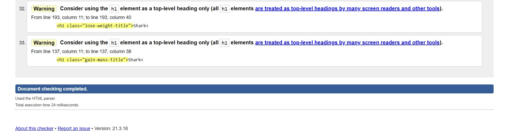

Solved HTML
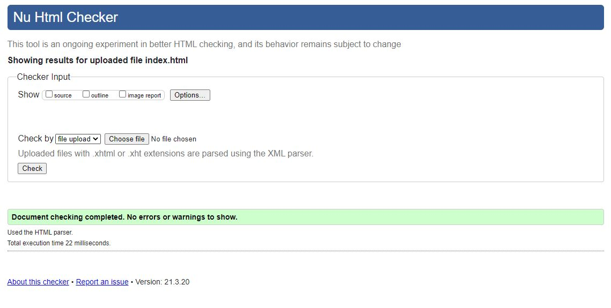

Checked CSS
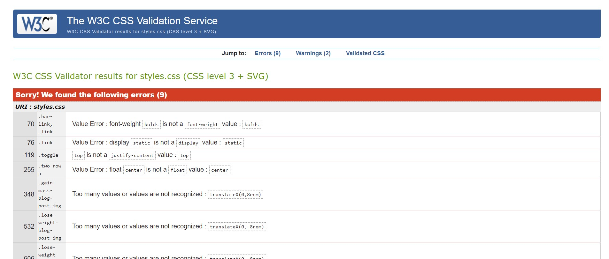

Solved CSS
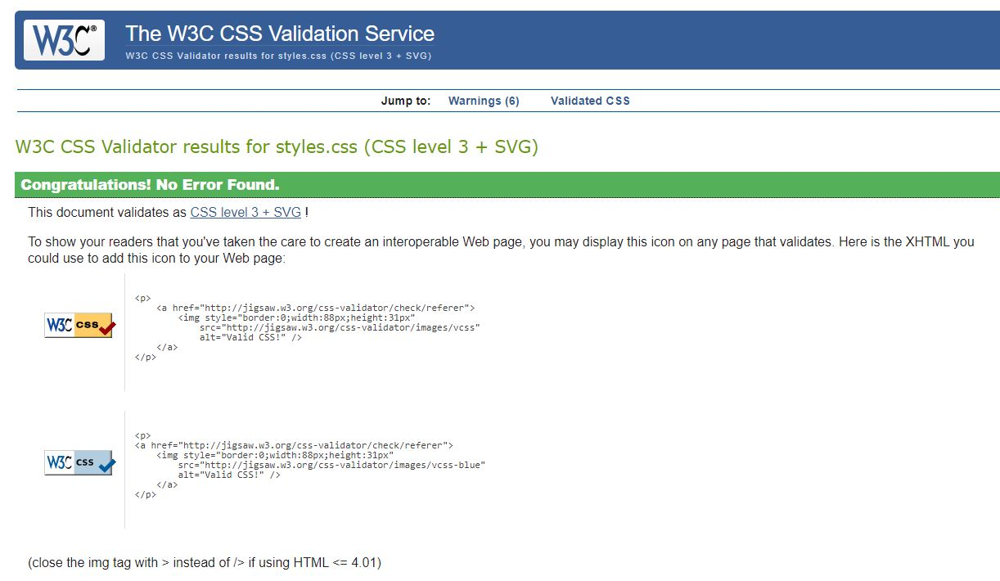


<a name="conclusion"></a>
## 6.0 Conclusion

Currently, a good singular page application design is vital. The website was designed During COVID-19 pandemic, to help people to work out while going through the lockdowns. In general, a good page layout has to satisfy the advanced elements of a good design without a creation of Application Programming Interface (API). This is included in creation of Fitness@Home website in sense of green colour design and font selections, responsive style page and alimentations. The project has helped the author to gain a good knowledge of HTML while setting the layout, the responsive style and frame of the website Fitness@Home. During the creation of the website Fitness@Home the author’s knowledge, understanding and skill improved regarding CSS and JS as simple straight forwarding styles more as a connection to HTLM.  JS has some Document Object Models (DOM) as well as JavaScript Object Notation (JSON) to help the idea, but it is difficult to use JSON to obtain external API data.

<a name="reference"></a>
## 7.0 Reference

Coyier, C. (2019) <em> Need to scroll to the top of the page?</em> [Online] Available at: https://css-tricks.com/need-to-scroll-to-the-top-of-the-page [Accessed 17 February 2021].

Frik, K. (no date) <em> Redempt Footer. </em> [Online] Available at: https://codepen.io/kylefrik/pen/OJbxBQE [Accessed 29 February 2021].

Hovhannisyan, A. (2020) <em> Creating a Responsive Navbar Without Bootstrap. </em> [Online] Available at: https://www.aleksandrhovhannisyan.com/blog/responsive-navbar-without-bootstrap/ [Accessed 12 February 2021].

Julio Codes, (2019) <em> Build a Responsive News Blog Post Card | HTML and CSS Tutorial. </em> [Online] Available at: https://www.youtube.com/watch?v=XRzAZBPp5iQ [Accessed 23 February 2021].

Morales, A. (2018) <em> Sliding arrow css animations. </em> [Online] Available at: https://codepen.io/alianmorales/pen/GyrgjO [Accessed 25 February 2021].

Sina, E. (2019) <em> How to create a beating heart with pure CSS for your valentine? </em> [Online] Available at: https://medium.com/@ebnsina/how-to-create-a-beating-heart-with-pure-css-for-your-valentine-da7085c8619a [Accessed 18 February 2021].

Stuart, G. (2021a) <em> CTEC3905 lab materials. </em> [Online] Available at: https://github.com/CTEC3905-2020-21/lab-materials/blob/master/readme.md [Accessed 27 Juauary 2021].

Stuart, G. (2021b) <em> Lab 4: A responsive menu. </em> [Online] Available at: https://github.com/CTEC3905-2020-21/lab-materials/blob/master/lab-04.md [Accessed 21 February 2021].

Stuart, G. (2021c) <em> Lab 5: Working with user input. </em> [Online] Available at: https://github.com/CTEC3905-2020-21/lab-materials/blob/master/lab-05.md [Accessed 23 February 2021].

Stuart, G. (2021d) <em> Lab 7: Working with APIs. </em> [Online] Available at: https://github.com/CTEC3905-2020-21/lab-materials/blob/master/lab-07.md [Accessed 27 March 2021].

Underwood, P. (2016) <em> CSS Animation Link Underline. </em> [Online] Available at: https://paulund.co.uk/css-animation-link-underline [Accessed 12 February 2021].

Vybiral, K. (2017) <em> Responsive movie card. </em> [Online] Available at: https://codepen.io/kvyb/pen/rKdPOq [Accessed 14 February 2021].


<a name="weekly-journal"></a>
## 8.0 Weekly-Journal

### 8.1 Lab 1 (Getting started)

The week work started a bit unclear about the task that I needed to do so I decided to start the work on things I understand well. In Front-End Web Development, I introduce the three software tools such as installing Google Chrome, Atom and GIT on my computer.

I am hard of hearing and it is a challenge for me to follow the lecture and lab tuitions online, as lecturer talked during lecture recording (Panopto) and I was not able to see his face and read his lips. I had to use otter app which is like the electronic note-taker. The app speech to texted helped me to understand how to use GitHub, Atom and Website.

First, I open google chrome and I visit the Atom website then I just press ```F12``` as same as click right mouse to inspect. alternatively, opening chrome menu and selecting more tools and developer tools. I understand when I see the element on developer tools and I easily type ```class="hero-logo-circles"``` and image showing.
I added some CSS styles this line in the HTML head section as ```<link rel="stylesheet" href="styles.css">``` and I create a styles.css file, trying to be careful working on it.

I add some java script line in the HTML head section as ```<link rel="stylesheet" href="styles.css">``` creating a styles.css file.
Then, I create a git repository from our code such as a lab-work folder on assignment from gitbash. and typeing git init and showing several git commands runs inside repository below:

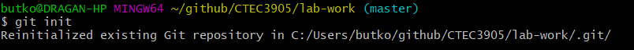

“.git” is appeared on atom, and it works.

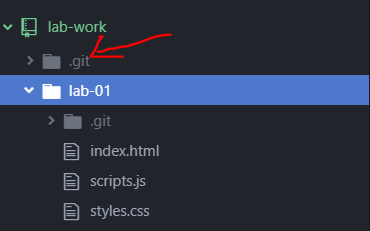

Typing “git status” and checking the situation, two red untracked files.

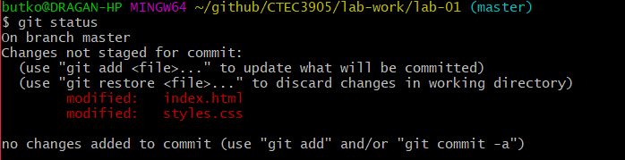

Typing “git add .” and adding entire project into the stage area.

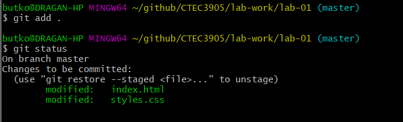

Typing ```git commit -m "lab-01: my first commit"``` and it is very helpful.

But I did not understand how to commit and push my repository as it was always showing error so I asked Mr Stuart to help me.  I emailed him how to host on the GitHub and he helped me to provide intrusions for working with remote repositories (cloning, pulling and pushing code) such as those hosted on GitHub. Using Atom for GitHub and login my account is successfully completed before and I thanked him. I also accomplished validating my code with validators and committing my update to a git repository.

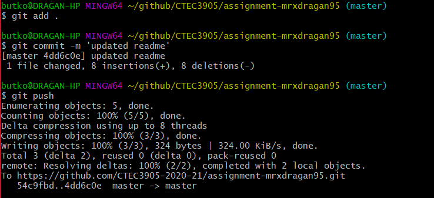

### 8.2 Lab 2 (A bit more of everything)

Lab 1 and Lab 2 are fine, I listened to lecturer well for introducing to HTML, CSS and JavaScript. I would like to build an own website. I have some experience in doing so in my foundation year in the university of Derby.

In lab 2, I learned how to make a link stylesheet to an HTML file and edit a simple menu on my HTML, colour and box-model parameters before make hover and transition. It was a challenge to repeat Addy Osamani’s home page and the page is very simple in structure but this code is harder than it needs to be. I think I improved my knowledge in doing the structure to make my own website, after paying attention to Addy Osamani webpage.  

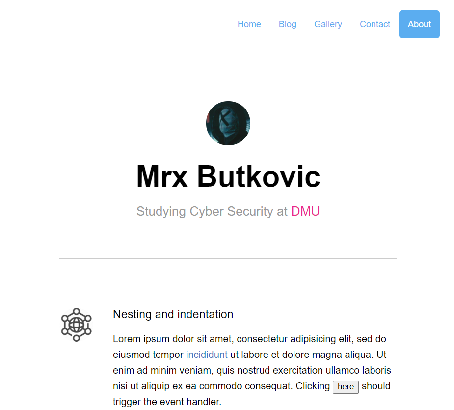

### 8.3 Lab 3 (Introduction to git and GitHub)

I have been currently using the GitHub.  Since my first year I know how to use programming in C. I placed some scripts and performed on GitHub. In addition, I have also learned how to use GIT bash during my module Software and Security Management in my second year. I am glad for having the knowledge of using both GIT and GitHub. In the lab 3, I learn the cloning and pushing existing code to GitHub that would be helpful.

### 8.4 Lab 4 (A Responsive Menu)

In my foundation year, I did not know how to make a responsive menu like width desktop, tablet and mobile style probably because the Foundation year just gives a basic knowledge of creating a website. I recently looked for an example of HTML and CSS responsive design and now I understand much more about the lecture where the lecturer talked about that. Before Lab 4, I found a responsive menu CSS3 and HTML5 without framework like few JavaScript on code pen and I took a part of code before I execute this challenge on my own assignment. It took me   2 weeks, to fix once responsive menu and I like the idea of a creation heart animated by the researcher and I included this on navbar.


### 8.5 Lab 5 (Working with user input)

I know both ```<form>``` and ```<input>``` that I learned previously during my study and I am glad that both are working well. This has to be pleased on the “contact us” in the end of front-end web development. In addition, search <input> is included too. I decide to add in this form like name, Email and messages on my own assignment.

### 8.6 Lab 6 (Working with data)

I was unable to work on this lab 6 so I focused on my development project.

### 8.7 Lab 7 (Getting data from APIs)

During this lab session I was following the tutorial how to review data from API with JSON.  I then took the challenge to build a fully featured search and display application for the online collection of blog and amazon. However, I had difficulties to fully grasp ways how to make JSON on JavaScript with API. It took me 2 weeks to learn this as I watched the tutorial on this subject and I was able to understand.

### 8.8 Lab 8 (Animations)

I am really delighted that I managed to make the animated beating heart which I wanted to include into my website. Another animated rubberBand are added in the each slider after clicking current next and previous.

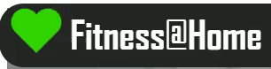
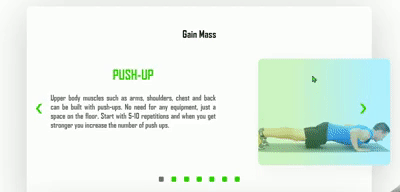

<a name="reflective-writing"></a>
## 9.0 Reflective Writing

The Fitness@Home website is completed and the HTML, CSS and JS are important because learning them all together cause improvement of my skills. In the beginning of the project there were some struggles and abstracts which needed to be overtaken in order to accomplish the given task. The learning of the new software like Git and ATOM was a challenge mainly in the beginning. The answer for fixing some errors in the codes was solved by using Chrome developers. "It is better to be perfectly useful than uselessly perfect" (Dreimer Quote).

The learning outcome was grasping the techniques used in the Front-end web development that would include the sophisticated animation, responsive styles for Desktops, mobile phones, and tablets as well as some complex Documents Objects Modelling. All this was in order to gain website development skills.

As weeks passed the weekly lab work was progressing and the lab work improve my technique. I was gaining new knowledge for building the codes.  It was a challenge to change the advanced codes for lecturer's code from lab materials 1-8 documents. There was good building skill achieved from tools developing testing.  The provided lectures helped me building code’s technique.

I have also experienced a bit of the difficulties when using the JSON external API from week 7. However, the problem was mainly in causing errors such as indicating that there was not found any API at the end. There is still a lot to be learned and understand about my own API. A lot of practice and testing would need to be undertaken in my further study and work in order to enhance personal awareness about Document objects modelling.
